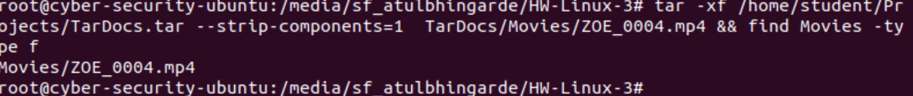

# Submission

### Tar
#### Stripping Components
- **Exercise 2**
  - Extract `Movies`: `YOUR SOLUTION COMMAND HERE`
  

  - Extract `Movies/ZOE_0004.mp4`: `your command here`
  
  - Extract files from `TarDocs/Movies` without `TarDoc/Movies` structure

#### Modifying Archives
- **Exercise 1**

  ```bash
  # Insert the solution commands for Exercise 1 below
  ```

- **Exercise 2**

  ```bash
  # Insert the solution commands for Exercise 2 below
  ```

- **Exercise 3**

  ```bash
  # Insert the solution commands for Exercise 3 below
  ```

#### Incremental Backups
- **Exercise 1**
  - A **snapshot file** is `YOUR DEFINITION HERE`.
  - A **backup level** is `YOUR DEFINITION HERE`.
  - A **level 0 backup** is `YOUR DEFINITION HERE`.

- **Exercise 2**

  ```bash
  # Insert the solution commands for Exercise 2 below
  ```

### Cron
#### Managing cron
Please paste the contents of `backup-cron-jobs.txt` in the space below.

  ```bash
  # Paste the contents of `backup-cron-jobs.txt` below
  ```
